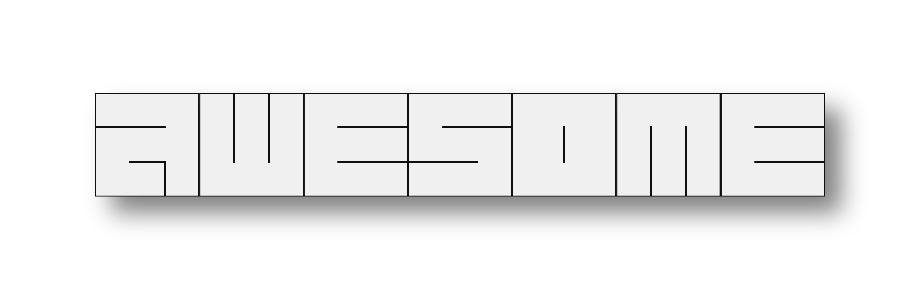
<br>
# I just get [`this`](https://github.com/Sinomor/dotfiles) dotfiles, and remade it
## This dotfiles does not affect other programs (terminal, browser, telegram) and contains only the WM setting!!!
<details>
<summary><b>Screenshots</b></summary>
   
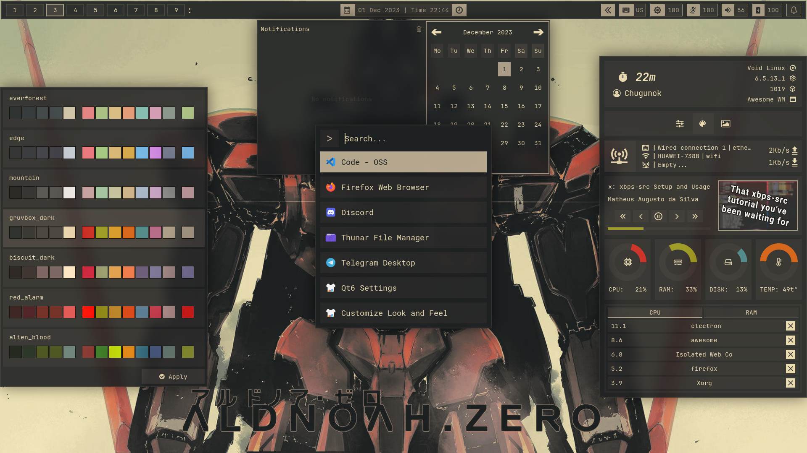
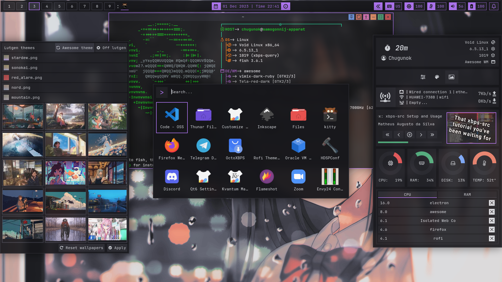

</details>
<details>
<summary><b>Widgets</b></summary>
   
### Bar
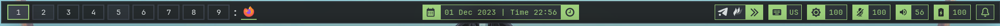
***

### Control
Comments:
- Fetch (in top) use remade pfetch script
- Crutch top (in bottom) use ps utility,so it shows how much the program consumes cpu per 1 core (if you have 4 cores, then divide the process’s CPU indicator by 4 and this will be its load on the entire CPU)
- If you want the slider to work in your browser, then download `plasma-browser-integration` package and `plasma integration` extension in your browser and uncheck `Enhanced Media Control` in extension settings

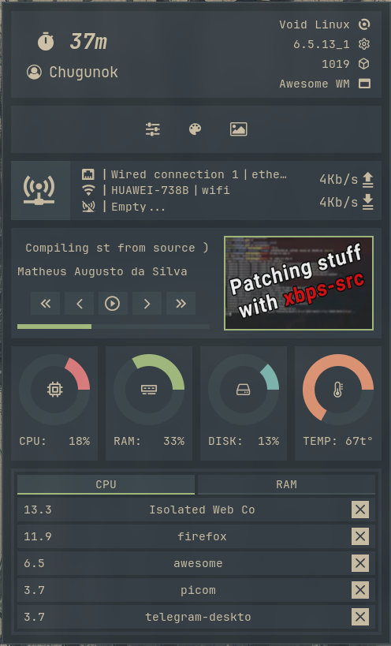
***

### Settings
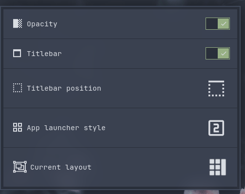
### Theme changer

<details>
<summary>Available themes</summary>
   
- [Nord]
- [Alien Blood]
- [Mountain]
- Red Alarm
- [Biscuit Dark]
- [Gruvbox Dark]
- [Sonokai]
- [Catppuccin]
- [Edge]
- [Everforest]
- [Everforest soft]
- Stardew

</details>

   [Nord]: <https://www.nordtheme.com/>
   [Alien Blood]: <https://github.com/thomasabishop/alien-blood-vscode/>
   [Mountain]: <https://github.com/mountain-theme/Mountain/>
   [Biscuit Dark]: <https://github.com/Biscuit-Colorscheme/biscuit/>
   [Gruvbox Dark]: <https://github.com/morhetz/gruvbox/>
   [Sonokai]: <https://github.com/sainnhe/sonokai/>
   [Catppuccin]: <https://github.com/catppuccin/catppuccin/>
   [Edge]: <https://github.com/sainnhe/edge/>
   [Everforest]: <https://github.com/sainnhe/everforest/>
   [Everforest soft]: <https://github.com/sainnhe/everforest/>
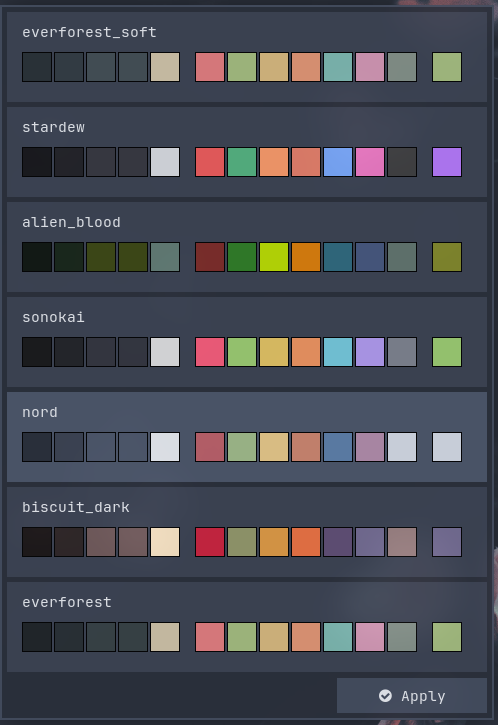
***

### Wallpapers launcher
Comments:
- Put your wallpaper in a ~/.walls
- Uses Lutgen in the form of a binary file, which is located inside the repository

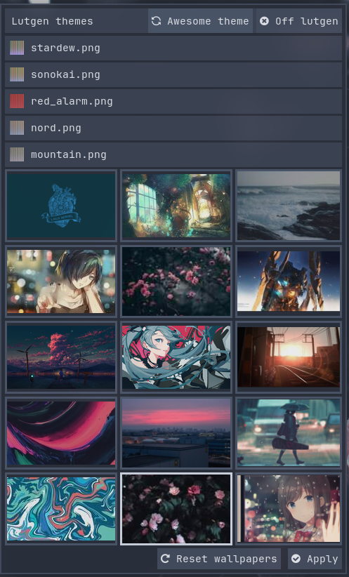
***

### Calendar + Notification center
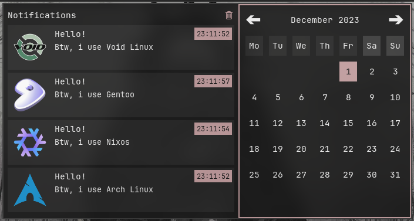
***

### Greenclip (rofi)
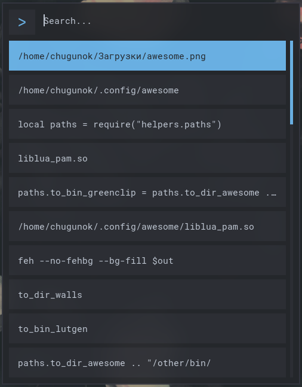
***

### App launcher (rofi)
|type 1|type 2|type 3|type 4|
|--|--|--|--|
|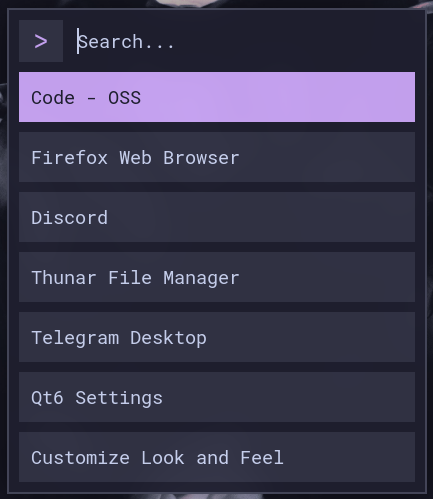|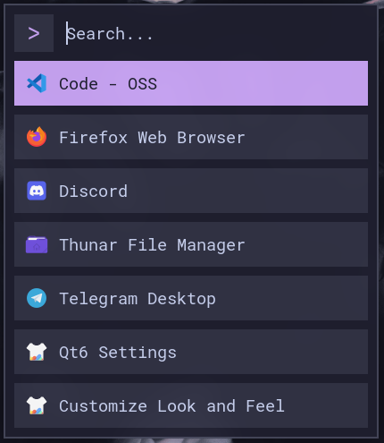|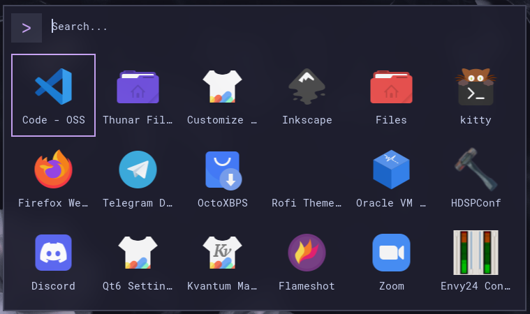|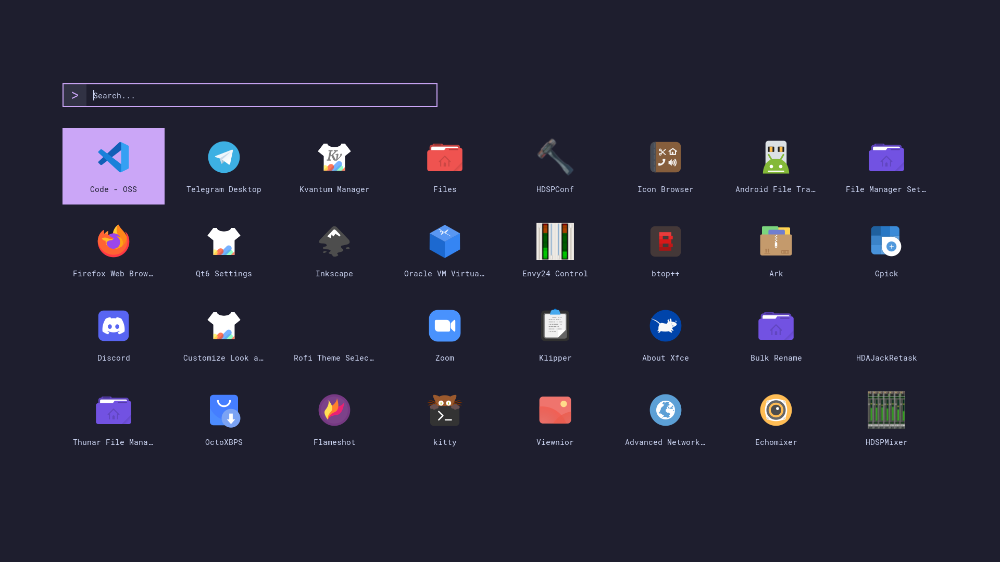|
***

### Powermenu
Comments:
- You can focus to option with keyboard arrow
- You can activate option with press x or Enter or click

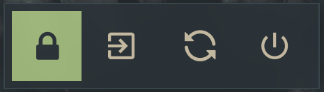
<hr>

### Lockscreen
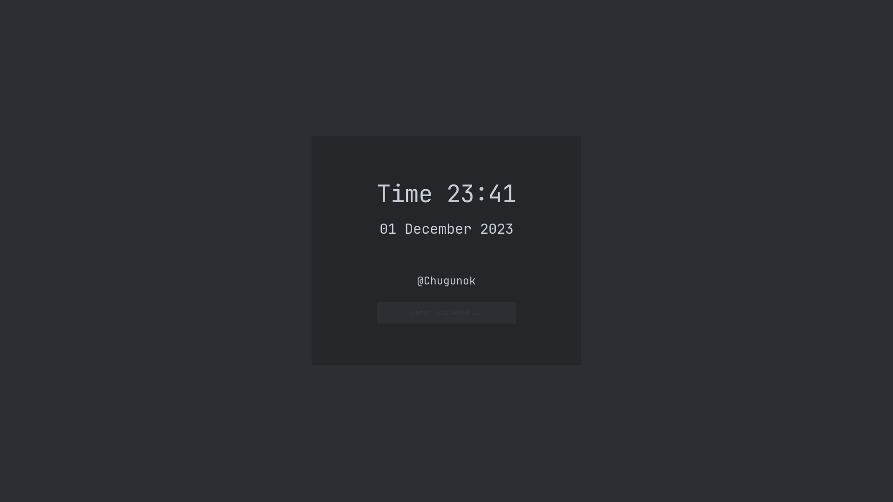
      
</details>

<details>
<summary><b>Install</b></summary>
   
#### Require a [awesome-git](https://github.com/awesomeWM/awesome) version
#### Install dependencies
1. ##### Lite dependencies:
     - ##### In Void linux:
       ```bash
       $ sudo xbps-install feh fontconfig NetworkManager rofi flameshot alsa-utils xclip xrdb picom polkit-gnome ImageMagick playerctl brightnessctl nerd-fonts-symbols-ttf
       $ fc-cache -f -v
       ```
     - ##### In Arch linux:
       ```bash
       $ sudo pacman -S feh fontconfig networkmanager rofi flameshot alsa-utils xclip picom polkit-gnome imagemagick playerctl brightnessctl ttf-nerd-fonts-symbols
       $ fc-cache -f -v
       ```
     - ##### In Ubuntu:
       ```bash
       $ sudo apt-get install feh fontconfig network-manager rofi flameshot alsa-utils xclip picom policykit-1-gnome imagemagick playerctl brightnessctl 
       $ wget https://github.com/ryanoasis/nerd-fonts/releases/download/v3.1.1/NerdFontsSymbolsOnly.zip
       $ unzip NerdFontsSymbolsOnly.zip
       $ cp ~/Downloads/NerdFontsSymbolsOnly/NerdFontsSymbolsOnly*.otf ~/.local/share/fonts/
       $ fc-cache -f -v
       ```
1. ##### Hard dependencies:
   - Install [`PipeWire`](https://pipewire.org/), WirePlumber 
   - Download JetBrainsMono Nerd font
      ```bash
      $ wget https://github.com/ryanoasis/nerd-fonts/releases/download/v3.1.1/JetBrainsMono.zip
      $ unzip JetBrainsMono.zip
      $ cp ~/Downloads/JetBrainsMono/JetBrainsMono*.otf ~/.local/share/fonts/
      $ fc-cache -f -v
      ```
#### Install dotfiles
```bash
$ git clone --depth=1 --recursive https://github.com/5TAHUR5/awesome-dotfiles.git
$ cd awesome-dotfiles
$ cp -R awesome ~/.config/
$ cp .xinitrc ~/
```
##### And put your wallpapers in '~/.walls' for wallpaper launcher

I recommend this wallpaper [repository](https://github.com/Sinomor/walls):
```bash
$ git clone --depth=1 https://github.com/Sinomor/walls.git
$ mkdir .walls
$ cp -r walls/* .walls/
$ rm -r walls
```

</details>
<details>
<summary><b>Keybinding</b></summary>

| Keybinding            | Description                              |
| --------------------- | ---------------------------------------- |
| `Mod+Shift+r`         | Restart awesomewm                        |
| `Mod+Enter`           | Open terminal                            |
| `Print`               | Take screenshot                          |
| `Mod+d`               | Open app launcher (rofi)                 |
| `Mov+v`               | Open greenclip (rofi)                    |
| `Mod+Shift+b`         | Hide bar                                 |
| `F keys`              | Control volume                           |
| `F keys`              | Control bright                           |
| `F keys`              | Control player                           |
| `Mod+c`               | Open calendar                            |
| `Mod+w`               | Open control                             |
| `Mod+x`               | Open powermenu                           |
| `Mod+f`               | Fullscreen focused client                |
| `Mod+s`               | Floating focused client                  |
| `Mod+q`               | Kill focused client                      |

| Client binds                                     | Description                   |
| ------------------------------------------------ | ----------------------------- |
| `Mod+` `_/=`                                     | Resize focused client gaps    |
| `Mod+Shift+` `_/=`                               | Resize all client gaps        |
| `Mod+`  `l/h`/`Right/Left`                       | Move focus client             |
| `Mod+Ctrl+`  `k/j/h/l`/`Up/Down/Left/Right`      | Resize focused client         |
| `Mod+Shift+`  `k/j/h/l`/`Up/Down/Left/Right`     | Move or swap by direction     |
| `Mod+Shift+Ctrl+`  `k/j/h/l`/`Up/Down/Left/Right`| Relative move  floating client|

</details>
<details>
<summary><b>Mousebinding</b></summary>
   
| Mousebinding           | Description        |
| ---------------------- | -------------------|
| `Mod+Left button`      | Move client        |
| `Mod+Right button`     | Resize client      |

</details>

<details>
<summary><b>TODO</b></summary>
   
- Correct dpi
- Make the code more optimal
- ~~Replace the liblua_pam with a more convenient solution~~
   
</details>

## If you have any problems, write to me in [telegram](https://t.me/ban_ocka). (in other social networks i rarely appear) !!!
***
### See also
- Sinomor [dotfiles](https://github.com/Sinomor/dotfiles)
- Myagko [dotfiles](https://github.com/Myagko/dotfiles)
- Stardust kyun [Sakura dotfiles](https://github.com/Stardust-kyun/dotfiles)
- Chadcat7 [crystal](https://github.com/chadcat7/crystal)
- Tsukki [tsukiyomi](https://github.com/tsukki9696/tsukiyomi)
- TorchedSammy [dotfiles](https://github.com/TorchedSammy/dotfiles)
- Ner0z  [dotfiles](https://github.com/ner0z/dotfiles)
- Saimoom [dotfiles](https://github.com/saimoomedits/dotfiles/tree/main)
